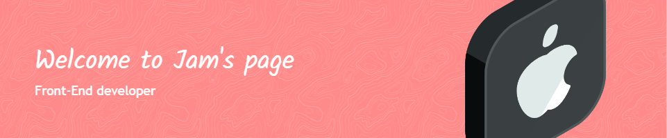

<!--  -->
<!--  -->

<picture>
  <source media="(prefers-color-scheme: dark)" srcset="https://raw.githubusercontent.com/platane/platane/output/github-contribution-grid-snake-dark.svg">
  <source media="(prefers-color-scheme: light)" srcset="https://raw.githubusercontent.com/platane/platane/output/github-contribution-grid-snake.svg">
  
</picture>  

   

  
  
  

### 🎲 Platforms & Languages

  &nbsp;
  &nbsp;
  &nbsp;
  &nbsp;
  &nbsp;
  &nbsp;
  &nbsp;
  &nbsp;
  &nbsp;
  &nbsp;
  
  

<!--

  
  
  
  
  
  
  
  
  

  
-->  
   

### 🎓 Jam's Log

SeoulTech (2015 ~ 2020) 👨‍🎓   
Army Reserve Officer (2020 ~ 2022) 💂‍♂️  
Samsung SW Academy For Youth 9th (2023) 👨‍💼

### 📗 Certificate  
Engineer General Machinery ('22.06.17)  
OPIc(en) Intermediate High ('22.07.30)  
Engineer Information Processing(wr) ('22.06.14)  
Advanced Data Analytics Semi-Professional ('23.06.16)   
